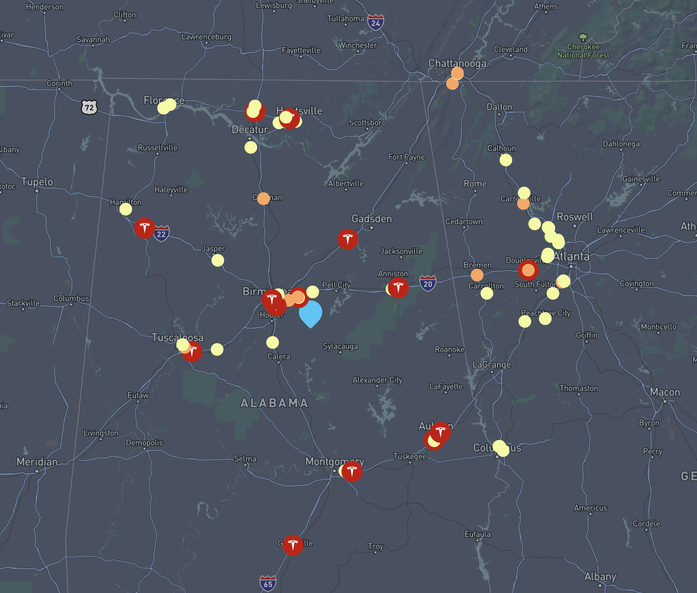

# Charge Finder

Building an interactive map for electric charging stations with Postgres, Postgis and Mapbox.



### Getting Electric Charging Data

We can leverage OpenStreetMaps to get almost *any* type of data and download it as **geojson**.

Here's is a wizard for finding different data points via [OverpassTurbo](https://overpass-turbo.eu/).


We downloaded this as a geojson file, wrote a quick script `populate.py` that inserted the data into our Postgres database.

### Creating GeoSpatial Table with Postgis 

```sql
CREATE TABLE charging_stations (
    id SERIAL PRIMARY KEY,
    lat DOUBLE PRECISION,
    lng DOUBLE PRECISION,
    metadata JSONB,
    name TEXT,
    operator TEXT,
    geom GEOMETRY(Point, 4326)  
);

CREATE INDEX charging_stations_geom_idx 
ON charging_stations USING GIST (geom);
```


### Querying for nearest points in Postgis

```sql
SELECT id, lat, lng, metadata, ST_Distance(geom, ST_SetSRID(ST_MakePoint(${lng}, ${lat}), 4326)) AS distance
FROM charging_stations
ORDER BY geom <-> ST_SetSRID(ST_MakePoint(${lng}, ${lat}), 4326)
LIMIT 100
```

*calculates the distance between each charging station and a specified point (with given latitude and longitude). It orders the results based on the proximity to this point, using the PostGIS operator <-> for efficient nearest neighbor searching, and limits the result to the 100 closest stations*